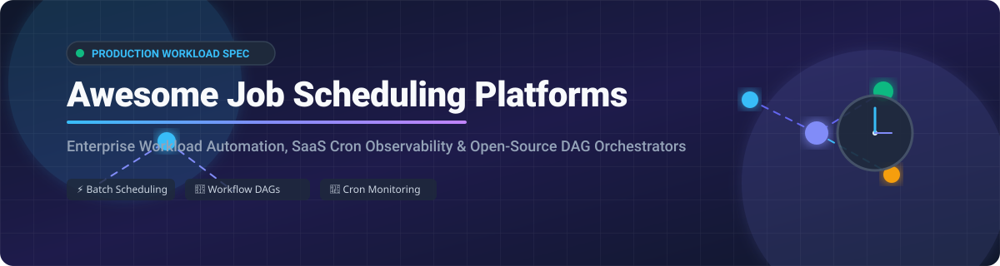

# Awesome Job Scheduling Platforms

## Curated List of SaaS Workload Automation & Open-Source Job Schedulers

> **Comprehensive directory of Enterprise Workload Automation (WLA), Cron Monitoring SaaS, Batch Schedulers, and Open-Source Workflow Orchestrators (DAGs).**

*Last updated: September 2026*

---

## Overview & Market Insights

**Estimated Sector Market Size:** The global Enterprise Workload Automation & Job Scheduling market is estimated at **$3.2 Billion (2026)** and is projected to reach **$5.2 Billion by 2030** (CAGR ~8.8%).

**Market Dynamics:** The sector is **moderately fragmented**. High-end enterprise workloads and mainframe-to-cloud migrations are dominated by consolidated legacy orchestrators (such as BMC Control-M and Redwood Software), whereas cloud-native data pipelines and developer workflows are heavily split among modern open-source DAG engines (Apache Airflow, Temporal, Prefect, Dagster) and specialized micro-SaaS cron observability platforms.

---

## Table of Contents

- [SaaS & Hosted Workload Automation Platforms](#saas--hosted-workload-automation-platforms)
- [Open-Source Job Schedulers & Orchestrators](#open-source-job-schedulers--orchestrators)
- [Architecture & Selection Guide](#architecture--selection-guide)
- [How to Contribute](#how-to-contribute)
- [License & Disclaimer](#license--disclaimer)

---

## SaaS & Hosted Workload Automation Platforms

The table below outlines major commercial SaaS platforms and enterprise workload automation solutions, ordered by estimated **Company Size (Revenue / Valuation)** descending.

| Platform / Product | Description | Pricing (Starting Tier) | Free Tier / Trial Limits | Company Size (Revenue / Valuation) |
| :--- | :--- | :--- | :--- | :--- |
| **[Control-M (BMC)](https://www.bmc.com/it-solutions/control-m.html)** | Enterprise workload automation & application workflow orchestration across mainframe, cloud, and hybrid IT. | $2,400 / month *(Starter Pack, billed annually)* | No free tier; 14-day interactive demo & custom trial upon request | **~$14B–$15B Valuation** *(~$2.3B Annual Revenue)* |
| **[RunMyJobs by Redwood](https://www.redwood.com/)** | SaaS-native workload automation platform for enterprise ERP, business processes, and IT execution. | $1,000 / month *(Consumption-based starting tier)* | No free tier; 30-day fully functional trial post-demo | **~$2.5B Valuation** *(~$76.7M ARR)* |
| **[ActiveBatch (Redwood)](https://www.advsyscon.com/)** | Enterprise job scheduler with cross-platform connectors, event triggers, and low-code workflow designer. | $950 / month *(Starting annual server license)* | No free tier; 30-day full-access trial license | **~$2.5B Valuation** *(~$76.7M ARR)* |
| **[Stonebranch](https://www.stonebranch.com/)** | Universal Automation Center for real-time event-driven job scheduling and hybrid IT orchestration. | $500 / month *(Subscription entry tier)* | No free tier; 30-day free trial with full feature access | **~$18.5M ARR** *(EMH Partners backed)* |
| **[Azkaban Enterprise](https://azkaban.github.io/)** | Enterprise-grade commercial support and managed deployment services for LinkedIn Azkaban workflows. | $300 / month *(Managed support package)* | Free self-hosted Apache 2.0 open-source core | **~$10M Ecosystem** *(Commercial Open Source)* |
| **[Cronitor](https://cronitor.io/)** | Modern developer cron job monitoring, uptime telemetry, and background worker observability platform. | $7 / month *(Business plan: $2/mo per monitor + $5/mo per seat)* | Free Forever (5 monitors, 1 status page, email/Slack alerts) + 14-day trial | **~$2.5M ARR** *(Bootstrapped / Private)* |
| **[VisualCron](https://www.visualcron.com/)** | Windows-centric job scheduler, task automation server, and integration engine with rich UI. | $229 / year *(~$19.08/mo per server license)* | No free tier; 30-day unrestricted full free trial | **~$2.0M Revenue** *(Acquired by Continuous 2022)* |
| **[EasyCron](https://www.easycron.com/)** | Hosted web cron service for triggering remote HTTP webhooks, API endpoints, and scheduled scripts. | $24 / year *($2.00/mo on annual plan)* | Free Forever (5 active cron jobs, 200 executions/day, 20-min min interval) | **~$1.0M Revenue** *(Privately held)* |
| **[QuartzDesk](https://www.quartzdesk.com/)** | Enterprise management and web monitoring GUI console for Quartz-based Java job scheduling engines. | $28 / month *($336/yr perpetual license)* | Free Lite Edition (up to 3 Quartz engines) & 30-day trial | **~$500K Revenue** *(Privately held)* |
| **[Schedulix](https://www.schedulix.org/)** | Open-core enterprise job scheduling system with workload balancing and complex dependency handling. | $150 / month *(Enterprise commercial support tier)* | Free self-hosted AGPL open-core with unlimited jobs | **~$500K Revenue** *(independIT GmbH)* |

---

## Open-Source Job Schedulers & Orchestrators

Below is a curated list of top open-source job schedulers, task queues, and DAG workflow orchestrators, sorted by **GitHub Star Count** descending.

- **[Apache Airflow](https://github.com/apache/airflow)**   
  Leading Python-based workflow management platform to programmatically author, schedule, and monitor data pipelines as Directed Acyclic Graphs (DAGs).

- **[Celery](https://github.com/celery/celery)**   
  Asynchronous task queue/job queue based on distributed message passing, focused on real-time operation and background task scheduling in Python.

- **[Prefect](https://github.com/PrefectHQ/prefect)**   
  Modern Python-native workflow orchestration framework enabling dynamic flow construction, hybrid cloud execution, and observable data assets.

- **[Temporal](https://github.com/temporalio/temporal)**   
  Open-source durable execution engine that guarantees fault-tolerant execution of microservice workflows and long-running distributed background jobs.

- **[Luigi](https://github.com/spotify/luigi)**   
  Python framework developed by Spotify for building complex batch job pipelines with automated dependency resolution, visualization, and Hadoop integration.

- **[Argo Workflows](https://github.com/argoproj/argo-workflows)**   
  Kubernetes-native workflow engine for orchestrating parallel containerized jobs and compute-intensive tasks on Kubernetes clusters.

- **[Dagster](https://github.com/dagster-io/dagster)**   
  Asset-oriented data orchestrator designed for defining, testing, and observing software-defined data assets and production pipelines.

- **[Apache DolphinScheduler](https://github.com/apache/dolphinscheduler)**   
  Distributed visual workflow scheduler platform committed to high-performance big-data and cloud-native job orchestration with a low-code UI.

- **[Sidekiq](https://github.com/sidekiq/sidekiq)**   
  Simple, efficient background job processing engine for Ruby applications utilizing Redis and multithreaded execution.

- **[gocron](https://github.com/go-co-op/gocron)**   
  Fluent and lightweight Go job scheduling library for running periodic, cron-like tasks inside Golang microservices.

- **[Quartz Scheduler](https://github.com/quartz-scheduler/quartz)**   
  Battle-tested Java enterprise job scheduling framework used for embedding complex, persistent cron schedules inside Java applications.

- **[Rundeck](https://github.com/rundeck/rundeck)**   
  Open-source runbook automation console and job scheduler for operations self-service, incident response, and infrastructure task orchestration.

- **[Azkaban](https://github.com/azkaban/azkaban)**   
  Batch workflow job scheduler developed at LinkedIn specifically designed to manage Hadoop jobs, ETL tasks, and artifact dependencies.

- **[Apache Oozie](https://github.com/apache/oozie)**   
  Workflow scheduler system dedicated to managing Apache Hadoop jobs in legacy enterprise big-data deployments.

---

## Architecture & Selection Guide

When selecting a job scheduling platform or workflow engine, consider the following technical criteria:

1. **Embedded Scheduling vs. External Orchestration:**
   - **Embedded (Quartz, gocron, Sidekiq, Celery):** Runs inside or alongside your application process; ideal for background tasks, webhooks, and light microservice jobs.
   - **External Orchestration (Airflow, Prefect, Temporal, Dagster):** Decoupled orchestration servers managing complex dependencies, retry logic, state retention, and visualization across heterogeneous infrastructures.

2. **Kubernetes-Native Execution:**
   - **Argo Workflows** and **Apache DolphinScheduler** provide native pod-level execution for containerized container-per-task workloads.

3. **Enterprise Workload Automation (WLA):**
   - Commercial solutions (**BMC Control-M**, **Redwood RunMyJobs/ActiveBatch**, **Stonebranch**) excel at mainframe integration, cross-platform file transfers, strict compliance/SLA tracking, and visual drag-and-drop workflow construction.

---

## How to Contribute

We welcome community contributions to expand this directory!

1. Fork this repository.
2. Update `README.md` following the table formatting (for SaaS) or star-sorted list (for Open-Source).
3. Ensure accurate details: name, direct documentation link, exact pricing/limits, and concise factual descriptions.
4. Submit a Pull Request with a clear description of your additions.

---

## License & Disclaimer

- License: [MIT License](LICENSE)
- *Disclaimer: Product trademarks, logos, and company names are the property of their respective owners. Pricing, free tier thresholds, and valuation estimates are gathered from publicly available references as of late 2026.*
